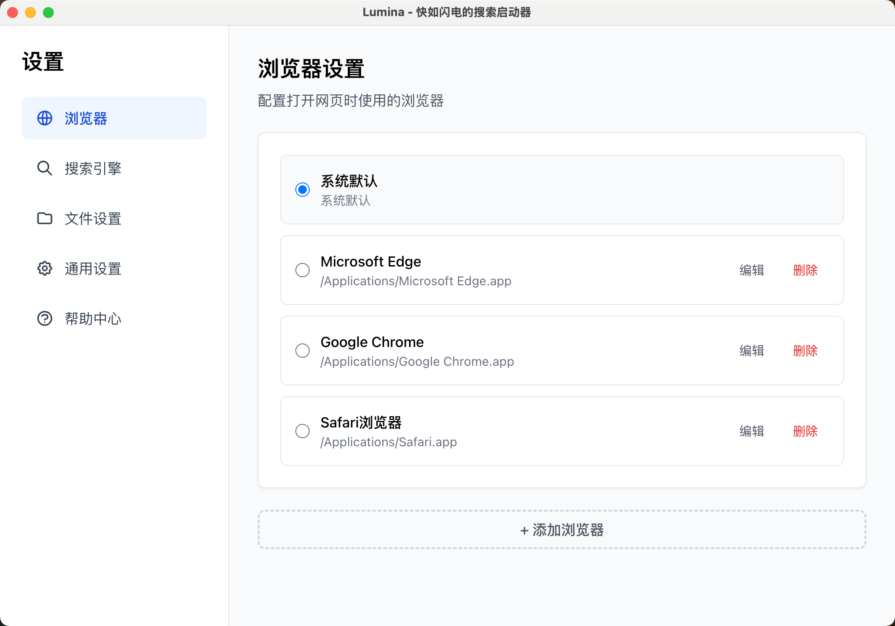

# Lumina（快搜）⚡️

> **免费的 Alfred 和 uTools 替代品** - 快如闪电的跨平台应用搜索启动器

[](https://github.com/yourusername/lumina)
[](https://opensource.org/licenses/MIT)
[](https://www.apple.com/macos/)
[](https://www.microsoft.com/windows)
[](https://www.linux.org/)

**Lumina** 是一个开源的应用程序启动器，灵感来自 macOS Spotlight、Alfred 和 uTools。提供快速的应用搜索、文件查找、网页搜索、书签管理等核心功能，支持 macOS、Windows 和 Linux。

🎯 **如果你正在寻找 Alfred 的免费替代品，或者喜欢 uTools 的便利性，Lumina 值得一试！**

## ✨ 为什么选择 Lumina？

| 特性 | Lumina | Alfred | uTools |
|------|--------|--------|--------|
| 价格 | 🆓 **免费开源** | 💰 £34（终身） | 💰 ¥299/年 |
| 开源 | ✅ MIT 开源 | ❌ 闭源 | ❌ 闭源 |
| 跨平台 | ✅ macOS/Win/Linux | ❌ 仅 macOS | ❌ 仅 Win/macOS |
| 自定义 | ✅ 完全可控 | ⚠️ 受限 | ⚠️ 受限 |
| 隐私 | ✅ 本地运行 | ⚠️ 有云同步 | ⚠️ 有云功能 |
| 应用搜索 | ✅ | ✅ | ✅ |
| 文件搜索 | ✅ | ✅ | ✅ |
| 书签管理 | ✅ | ✅ | ✅ |
| 计算器 | ✅ | ✅ | ✅ |
| 剪贴板历史 | ✅ | ✅ | ✅ |
| 编码解码工具 | ✅ | ⚠️ 需插件 | ✅ |
| 随机数生成 | ✅ | ⚠️ 需插件 | ✅ |
| 字符串工具 | ✅ | ⚠️ 需插件 | ✅ |
| 时间工具 | ✅ | ⚠️ 需插件 | ✅ |
| 翻译功能 | ✅ | ⚠️ 需插件 | ✅ |
| 变量名生成 | ✅ | ⚠️ 需插件 | ⚠️ 需插件 |
| 预览窗口 | ✅ | ✅ | ✅ |
| 插件系统 | 📝 计划中 | ✅ | ✅ |

> 💡 **Lumina 适合你，如果你**：喜欢 Alfred/uTools 的功能，但需要跨平台支持、更注重隐私、或者预算有限。

---

## 📋 目录

- [快速开始](#-快速开始)
- [主要功能](#-主要功能)
- [与 Alfred/uTools 对比](#-与-alfredutools-对比)
- [截图展示](#-截图展示)
- [安装方法](#-安装方法)
- [使用指南](#-使用指南)
- [系统要求](#-系统要求)
- [技术栈与架构](#-技术栈与架构)
- [开发者指南](#-开发者指南)
- [常见问题](#-常见问题)
- [贡献](#-贡献)
- [许可证](#-许可证)

## ⚡ 快速开始

### 对于用户

1. **下载**：前往 [Releases](../../releases) 下载最新版本
2. **安装**：拖拽到 Applications（macOS）或双击安装（Windows/Linux）
3. **启动**：按下 `Shift + Space` 打开搜索
4. **享受**：开始使用吧！

### 对于开发者

```bash
# 克隆项目
git clone https://github.com/yourusername/lumina.git
cd lumina

# 安装依赖
npm install

# 启动开发模式
npm run dev
```

---

## 🎯 主要功能

### 🔍 应用搜索与启动
- **智能索引**：利用 Spotlight（macOS）、Start Menu（Windows）、.desktop（Linux）快速索引
- **模糊搜索**：输入应用名、拼音或首字母，毫秒级响应
- **图标优化**：自动提取应用图标，自动压缩大图标（>50KB）
- **一键启动**：支持快捷键操作，统计使用频率
- **跨平台**：macOS（Spotlight API）、Windows（PowerShell + .NET）、Linux（桌面文件解析）

### 📁 文件搜索
- **系统原生**：使用 Spotlight（macOS）、Everything（Windows）、locate（Linux）
- **实时搜索**：无需预索引，直接调用系统搜索 API
- **配置灵活**：自定义搜索路径和范围
- **快速打开**：支持文件和文件夹双击打开

### 🌐 网页搜索
- 支持多个搜索引擎：百度、谷歌、必应、GitHub、知乎等
- **自动识别图标**：系统会自动为每个搜索引擎生成对应的品牌 logo（SVG 图标）
- 历史记录追踪常用网站
- 自定义搜索引擎（只需配置名称和 URL 模板）
- 快捷键快速切换引擎

### 📚 书签管理
- **多浏览器支持**：自动检测 Chrome、Safari、Firefox、Edge、Brave 等
- **配置文件识别**：支持多用户配置文件自动加载
- **实时同步**：文件监控自动检测书签变化
- **搜索优化**：支持标题和 URL 模糊搜索

### 🧮 计算器与工具
- **数学计算**：实时计算数学表达式，支持基本运算、三角函数、对数等
- **编码解码**：URL、HTML、Base64 编码/解码，MD5 加密
- **随机数生成**：UUID（v1/v4）、随机字符串、随机密码、随机数字
- **密码生成**：快速生成多个安全密码，支持自定义长度和字符类型（pwd/password/密码）
- **字符串工具**：大小写转换、命名格式转换（camelCase、snake_case等）、反转、去除空格、文本统计、字符串替换、正则提取
- **时间工具**：时间查询、时间戳转换、时间计算、日期格式化、时区转换
- **翻译功能**：多语言翻译（百度翻译 API），自动检测语言，快捷翻译命令
- **变量名生成**：根据描述自动生成多种命名风格的变量名（camelCase、snake_case、PascalCase、CONSTANT、kebab-case），支持中英文
- **TODO 管理**：完整的任务管理系统，支持创建、查询、完成、删除、编辑和搜索任务，支持优先级设置（高/中/低，红绿灯图标显示），预览窗口提供快速操作（修改优先级、标记完成、删除）
- **IP 网络信息**：快速查看网络信息，包括内网IP、外网IP、网关、DNS服务器等，每个信息一行，点击即可复制


### ⚡ 命令执行
- **系统命令**：锁屏、睡眠、重启、关机
- **媒体控制**：音量调节、静音、播放/暂停（部分平台需安装 nircmd）
- **应用快捷方式**：系统设置、文件管理器、终端、计算器
- **命令历史**：记录常用命令，快速重复执行

### 📋 剪贴板管理
- **自动记录**：自动记录剪贴板历史，支持文本和 HTML
- **智能去重**：相同内容自动去重，统计复制次数
- **快速搜索**：搜索剪贴板历史，快速粘贴
- **隐私保护**：本地存储，数据不离开你的设备

### ⚙️ 个性化设置
- **通用设置**：预览窗口开关、开机自启动、最小化到托盘、快速启动模式
- **搜索引擎**：支持添加、编辑、删除、排序搜索引擎（图标自动生成，无需手动配置）
- **浏览器设置**：配置默认浏览器和多个备用浏览器
- **文件搜索**：自定义搜索路径和启用/禁用
- **剪贴板设置**：配置剪贴板历史记录数量、保留天数
- **密码生成设置**：配置密码生成的默认长度、数量和字符类型（大小写字母、数字、特殊字符）
- **翻译设置**：配置百度翻译 API（AppID 和 Secret Key）
- **性能优化**：智能缓存机制，首次慢速索引 vs 缓存快速启动

### 🎨 用户体验
- **全局快捷键**：`Shift + Space` 随时唤醒（可自定义）
- **智能窗口**：自动调整窗口大小和位置，居中显示
- **预览窗口**：右侧显示详细信息预览，支持自动换行
- **系统托盘**：后台常驻，可配置关闭窗口是否退出
- **单实例**：防止重复启动，自动激活已运行实例
- **现代化 UI**：React + Tailwind CSS，流畅动画，暗色主题支持

---

## 🆚 与 Alfred/uTools 对比

### Lumina vs Alfred

**Lumina 优势：**
- ✅ 完全免费开源
- ✅ 跨平台支持（Windows、Linux）
- ✅ 源代码可自由修改
- ✅ 社区驱动，快速迭代

**Alfred 优势：**
- ✅ 插件生态更丰富
- ✅ 工作流功能更强大
- ✅ macOS 深度集成
- ✅ 部分高级功能需付费版

### Lumina vs uTools

**Lumina 优势：**
- ✅ 完全免费开源
- ✅ Linux 支持
- ✅ 代码开源可控
- ✅ 本地运行，隐私更好
- ✅ 无需网络功能

**uTools 优势：**
- ✅ 插件市场成熟
- ✅ 更多实用工具（OCR等）
- ✅ 云同步功能
- ✅ 社区活跃

**Lumina 已实现但 Alfred/uTools 需插件或付费的功能：**
- ✅ 编码解码工具（URL、Base64、MD5等）
- ✅ 随机数生成（UUID、随机字符串、密码）
- ✅ 字符串工具（转换、统计、替换等）
- ✅ 时间工具（查询、转换、计算）
- ✅ 变量名生成（多种命名风格）
- ✅ 翻译功能（多语言支持）
- ✅ TODO 管理（任务创建、查询、完成、删除、编辑、搜索，优先级管理）

---

## 📷 截图展示

### 主界面

*简洁优雅的主搜索界面，支持多种搜索类型*

### 应用搜索

*快速搜索并启动已安装的应用，支持拼音和中文搜索*

### 搜索选项

*丰富的搜索选项和分类结果展示*

---

## 💾 安装方法

### macOS

1. 从 [Releases](../../releases) 下载 `Lumina-xxx-arm64.dmg`
2. 双击打开 DMG 文件
3. 将 Lumina.app 拖拽到 Applications 文件夹
4. 在 Launchpad 中启动 Lumina

⚠️ **首次安装**：在"系统偏好设置 > 安全性与隐私"中允许打开未签名的应用。

### Windows

**安装版（推荐）：**
1. 从 [Releases](../../releases) 下载 `Lumina-Setup-xxx.exe`
2. 双击安装程序
3. 按照向导完成安装（支持自定义安装目录）
4. 在开始菜单中找到 Lumina

**便携版（可选）：**
1. 从 [Releases](../../releases) 下载 `Lumina-xxx.exe`
2. 直接双击运行，无需安装
3. 可在任意目录运行

### Linux

**AppImage:**
1. 下载 `Lumina-xxx.AppImage`
2. 添加执行权限：`chmod +x Lumina-xxx.AppImage`
3. 双击运行

**DEB 包:**
```bash
sudo dpkg -i Lumina-xxx.deb
```

---

## 📖 使用指南

### 基本操作

1. **打开搜索**：按下 `Shift + Space`
2. **搜索内容**：输入关键词
3. **选择结果**：使用 ↑↓ 键导航
4. **执行操作**：按 Enter 键
5. **关闭窗口**：按 Esc 键（应用会保持在系统托盘）

### 快捷键

- `Shift + Space`：打开/显示主窗口
- `Enter`：执行选中的项目
- `Esc`：关闭窗口（不会退出应用）
- `↑↓`：在结果列表中导航
- `Tab`：切换搜索结果分类（应用/文件/书签等）

### 高级技巧

- **应用搜索**：直接输入应用名称即可（支持拼音：`xiangku` → 向库）
- **文件搜索**：输入 `file <关键词>` 来搜索文件
- **计算器**：直接输入数学表达式，支持三角函数和单位转换
- **编码解码**：
  - `url encode <文本>` - URL 编码
  - `base64 encode <文本>` - Base64 编码
  - `md5 <文本>` - MD5 加密
- **随机数生成**：
  - `uuid` - 生成 UUID v4
  - `random string 16` - 生成 16 位随机字符串
  - `random password 20` - 生成 20 位随机密码
- **密码生成**（新功能）：
  - `pwd` - 生成 10 个默认长度的密码（每个密码是一个结果选项）
  - `pwd 20` - 生成 10 个 20 位长度的密码
  - `password` 或 `密码` - 同样支持，可指定长度
  - 在设置中可配置默认长度、生成数量和字符类型
- **字符串工具**：
  - `uppercase <文本>` - 转大写
  - `camel case <文本>` - 转驼峰命名
  - `reverse <文本>` - 反转字符串
  - `trim " <文本> "` - 去除空格
- **时间工具**：
  - `time` - 查询当前时间
  - `timestamp 1704067200` - 时间戳转换
  - `2024-01-01 + 10 days` - 时间计算
- **翻译功能**：
  - `translate hello` - 自动翻译
  - `en 你好` - 翻译为英文
  - `zh hello world` - 翻译为中文
- **变量名生成**：
  - `varname 用户名称` - 生成所有命名风格
  - `camel 订单列表` - 直接生成驼峰命名
  - `snake 商品价格` - 直接生成蛇形命名
- **TODO 管理**：
  - `todo 完成项目文档` - 创建任务
  - `todo` - 查看所有未完成任务
  - `todo all` - 查看所有任务（包括已完成）
  - `todo done 1` - 完成任务 ID 1
  - `todo delete 1` - 删除任务 ID 1
  - `todo edit 1 新内容` - 编辑任务内容
  - `todo edit 1 内容 --priority high` - 修改任务优先级
  - `todo search 项目` - 搜索任务
  - 优先级图标：🔴 高优先级、🟡 中优先级、🟢 低优先级（红绿灯样式）
  - 预览窗口：选择任务后可在右侧预览窗口快速修改优先级、标记完成或删除
- **IP 网络信息**：
  - `ip` - 查看网络信息（内网IP、外网IP、网关、DNS等）
  - `查看ip` - 查看网络信息
  - `网络信息` - 查看网络信息
  - 每个信息一行，点击即可复制
- **网页搜索**：输入关键词后点击搜索引擎图标切换
- **书签**：输入书签名称或 URL 快速访问
- **URL 识别**：输入网址自动识别并生成浏览器选项
- **剪贴板**：自动记录剪贴板历史，搜索 `clipboard` 查看历史

### 搜索技巧
- **拼音输入**：`vscode`、`xiangku`、`vs` 都可以匹配到 VS Code
- **首字母搜索**：`vs` 可以快速匹配多个应用
- **模糊搜索**：无需精确输入，智能匹配
- **常用优先**：最近使用的应用会自动排在前面
- **智能分类**：结果自动分类显示（应用、文件、书签、网页、命令等）
- **预览窗口**：鼠标悬停或使用方向键查看详细信息，支持自动换行

更多详细文档：
- [快速开始指南](docs/快速开始.md)
- [启动设置说明](docs/启动设置使用说明.md)
- [技术架构](docs/技术架构设计.md)
- [架构流程](docs/architecture-flow.md)

---

## 💻 系统要求

### 运行 Lumina
- **macOS**: 10.15 (Catalina) 或更高版本
- **Windows**: Windows 10 或更高版本
- **Linux**: 主流发行版（Ubuntu、Fedora、Debian 等）

### 开发者
- Node.js 18+ 
- npm 或 yarn

---

## 🏗️ 技术栈与架构

### 核心技术
- **Electron 28** - 跨平台桌面应用框架
- **React 18** - 现代化 UI 框架
- **TypeScript** - 类型安全的 JavaScript
- **Vite** - 极速构建工具
- **SQLite (sql.js)** - 本地数据持久化
- **Tailwind CSS** - 原子化 CSS 框架

### 架构特点
- **单例模式**：确保只有一个应用实例运行
- **IPC 通信**：主进程与渲染进程安全通信
- **服务化设计**：模块化服务管理（应用、文件、书签、索引等）
- **智能缓存**：数据库 + 内存双重缓存，快速响应
- **性能优化**：关键词预计算、批量操作、防抖搜索、索引优化

### 关键技术点
- **Windows 图标提取**：PowerShell + .NET 自动压缩大图标
- **Pinyin 支持**：中文拼音智能搜索
- **文件监控**：chokidar 实时监控书签变化
- **评分算法**：多维度搜索结果排序（匹配度、使用频率、名称长度）
- **定期索引**：后台自动更新索引（默认 10 分钟）

更多技术细节请参阅：
- [架构流程文档](docs/architecture-flow.md)
- [技术架构设计](docs/技术架构设计.md)

---

## 🔧 开发者指南

```bash
# 克隆项目
git clone https://github.com/yourusername/lumina.git
cd lumina

# 安装依赖
npm install

# 启动开发（Vite 开发服务器 + Electron 主进程）
npm run dev
```

默认开发地址：`http://localhost:3000`（渲染进程），主进程会根据环境自动加载相应 URL。

如需代码风格和质量检查：

```bash
npm run lint       # 检查
npm run lint:fix   # 自动修复
npm run format     # 使用 Prettier 格式化
```

更多操作请参见 `docs/快速开始.md`。

## 构建与发布

利用 electron-builder 进行跨平台打包：

```bash
# 仅构建产物（不生成安装包），并输出到 dist/ 与 dist-electron/
npm run build

# 构建各平台安装包
npm run build:mac
npm run build:win
npm run build:linux

# 一键构建三平台（需要在相应平台或配好交叉环境）
npm run build:all
```

构建输出：
- 渲染产物：`dist/`
- 主/预加载产物：`dist-electron/`
- 安装包与镜像：`dist/`（如 `.dmg`、`.zip`、`.AppImage`、`.deb`、`nsis` 等）

打包配置见 `electron-builder.yml`（`appId`、`productName`、图标、目标平台、Artifacts 命名等）。

## 运行时行为

- 单实例：尝试二次启动时会激活已运行实例并聚焦主窗口
- 首次启动：页面加载完成后触发“完整索引”
- 后续启动：若有缓存则快速加载，并并行刷新应用/文件/书签
- 定期索引：默认每 10 分钟刷新（`indexService.startPeriodicIndexing(10)`）
- 窗口关闭：不退出应用，常驻系统托盘，可从托盘或快捷键再次唤起

## 快捷键

- 全局：`Shift + Space` 显示主窗口（仅显示，不关闭）

> 若注册失败，会在控制台输出提示。可在系统偏好设置中检查是否被系统占用。

## 项目结构

```
electron-quick/
├── build/                  # 应用图标与打包资源
├── dist/                   # 渲染进程打包输出
├── dist-electron/          # 主/预加载打包输出
├── docs/                   # 项目文档（功能、架构、计划、API、教程等）
├── scripts/                # 构建与版本脚本
├── src/
│   ├── main/               # Electron 主进程
│   │   ├── index.ts        # 应用入口：单例、托盘、索引、全局快捷键、IPC 注册
│   │   ├── windows/        # 多窗口与窗口管理（main/settings/plugin）
│   │   ├── handlers/       # 各功能 IPC 处理器（app/file/web/...）
│   │   ├── services/       # 业务服务（索引/应用/文件/书签/设置/托盘等）
│   │   └── database/       # SQLite（sql.js）与持久化
│   ├── preload/            # 预加载（安全暴露 IPC 给渲染）
│   ├── renderer/           # React 18 + Tailwind UI
│   └── shared/             # 共用类型、常量、工具（窗口 URL、配置等）
├── electron-builder.yml    # 打包配置
├── vite.config.ts          # Vite 配置
└── package.json
```

## 架构与模块

- 主进程（`src/main`）
  - 单实例与生命周期管理（激活已运行实例、托盘常驻、`will-quit` 清理）
  - 窗口管理：`windowManager` + `WINDOW_CONFIGS` 统一创建/显示/隐藏/切换
  - IPC 注册：`register*Handlers()` 负责 app/file/web/browser/window/command/calculator/bookmark/settings 等
  - 全局快捷键：注册 `Shift+Space` 唤起主窗口
  - 索引：首次完整索引 + 周期索引；带缓存快速启动
- 预加载（`src/preload/index.ts`）
  - 通过 `contextBridge` 暴露受控 API，渲染进程无法直接触达 Node/Electron 原语，安全性更高
- 渲染进程（`src/renderer`）
  - React 18 视图，`App.tsx` 基于 `window.location.hash` 切换页面（主界面/设置）
  - Tailwind CSS 样式

更多设计细节与路线，参见 `docs/技术架构设计.md`、`docs/功能清单.md`、`docs/开发计划.md`、`docs/多窗口管理说明.md`。

## 预加载 API（Renderer 可用）

渲染进程可通过 `window.electron` 访问以下方法（内部经由 `ipcRenderer.invoke` 与主进程通信）：

```ts
// 通用
invoke(channel: string, ...args: any[]): Promise<any>
on(channel: string, callback: (...args: any[]) => void): void
removeListener(channel: string, callback: (...args: any[]) => void): void

// 应用
app.getAll(): Promise<any[]>
app.search(query: string): Promise<any[]>
app.launch(appId: string): Promise<any>
app.index(): Promise<any>

// 文件
file.getAll(): Promise<any[]>
file.search(query: string): Promise<any[]>
file.open(filePath: string): Promise<any>
file.index(paths?: string[]): Promise<any>

// 网页
web.getEngines(): Promise<any[]>
web.search(query: string, engineName?: string): Promise<any[]>
web.open(url: string): Promise<any>
web.getHistory(limit?: number): Promise<any[]>
web.clearHistory(): Promise<any>
web.getCommonSites(): Promise<any[]>
web.addEngine(engine: any): Promise<any>
web.updateEngine(name: string, updates: any): Promise<any>
web.deleteEngine(name: string): Promise<any>
web.setDefaultEngine(name: string): Promise<any>

// 浏览器
browser.getAll(): Promise<any[]>
browser.add(browser: any): Promise<any>
browser.update(id: string, updates: any): Promise<any>
browser.delete(id: string): Promise<any>
browser.setDefault(id: string): Promise<any>
browser.getDefault(): Promise<any>
browser.openUrl(url: string): Promise<any>

// 命令
command.getAll(): Promise<any[]>
command.search(query: string): Promise<any[]>
command.execute(commandId: string): Promise<any>
command.executeRaw(command: string): Promise<any>
command.getHistory(limit?: number): Promise<any[]>
command.clearHistory(): Promise<any>

// 计算器
calculator.calculate(expression: string): Promise<any>

// 书签
bookmark.getAll(): Promise<any[]>
bookmark.search(query: string): Promise<any[]>
bookmark.reload(): Promise<any>

// 设置
settings.getAll(): Promise<any>
settings.update(updates: any): Promise<any>
settings.reset(): Promise<any>

// 窗口
windowResize(width: number, height: number): Promise<void>
windowHide(windowType: string): Promise<void>
```

> 实际 IPC 通道名由主进程各 `register*Handlers` 实现，预加载仅做安全代理。

## 图标与品牌

- 资源位于 `build/` 目录，包含 `icon.png`、`icon.icns`、`icon.ico` 等
- 生成/更新图标：

```bash
npm run generate:icon
```

更多图标说明见 `docs/图标设置教程.md` 与 `build/ICON_SETUP.md`。

## 版本管理

提供语义化版本升级脚本：

```bash
# 升级补丁版本（Bug 修复）
npm run version:patch

# 升级次版本（新功能）
npm run version:minor

# 升级主版本（重大变更）
npm run version:major
```

## 开发规范与贡献

- 代码：TypeScript 为主
- 规范：ESLint + Prettier
- 提交：遵循 Conventional Commits（如 `feat: ...` / `fix: ...`）

欢迎贡献：
1. Fork 本仓库
2. 新建分支：`git checkout -b feat/awesome`
3. 提交更改：`git commit -m "feat: awesome"`
4. 推送分支：`git push origin feat/awesome`
5. 提交 Pull Request

---

## ❓ 常见问题（FAQ）

### 使用问题

**Q: 全局快捷键 `Shift + Space` 无效？**  
A: 可能是被系统或其他应用占用。在 macOS 上，前往"系统偏好设置 > 键盘 > 快捷键"检查是否有冲突。可以更换快捷键并重启应用。

**Q: 首次启动较慢？**  
A: 首次启动会自动索引所有应用、文件和书签，可能需要几分钟。完成后将进入快速启动模式（约 1-2 秒）。

**Q: 搜索结果不准确？**  
A: 在设置中关闭"快速启动"模式，让应用重新索引数据。

**Q: Safari 书签无法加载？**  
A: macOS 需要授予"完全磁盘访问"权限：系统偏好设置 > 安全性与隐私 > 隐私 > 完全磁盘访问 > 勾选 Lumina。

**Q: 文件搜索找不到某些文件？**  
A: 在设置中添加需要搜索的目录，或开启"扫描深度"选项。

**Q: 支持中文搜索吗？**  
A: 完全支持！可以输入拼音、首字母或中文名称进行搜索。

**Q: 剪贴板历史会占用很多空间吗？**  
A: 不会。默认最多保留 50 条记录，7 天后自动清理。可在设置中调整。

**Q: 翻译功能需要配置 API 密钥吗？**  
A: 需要。在设置 > 翻译设置中配置百度翻译的 AppID 和 Secret Key。首次使用会提示配置。

**Q: 预览窗口可以关闭吗？**  
A: 可以。在设置 > 通用设置中可以关闭预览窗口功能。

**Q: TODO 功能如何使用？**  
A: 输入 `todo` 查看所有未完成任务，输入 `todo 任务内容` 创建任务，输入 `todo done 1` 完成任务，输入 `todo delete 1` 删除任务。在预览窗口中可以快速修改优先级、标记完成或删除任务。

**Q: 如何设置任务优先级？**  
A: 创建任务时使用 `#high`、`#medium`、`#low` 标记优先级，或在预览窗口中点击"设为高/中/低"按钮快速修改。优先级通过红绿灯图标显示：🔴 高、🟡 中、🟢 低。

### 开发问题

**Q: 图标未生效？**  
确保 `build/icon.png` 存在，执行 `npm run generate:icon`，然后重新构建。

**Q: 如何调试？**  
开发模式下查看终端输出；生产模式下可以通过 `Cmd+Option+I` 打开开发者工具。

更多问题与进阶说明：
- [多窗口管理](docs/多窗口管理说明.md)
- [快速入门与故障排除](docs/快速开始.md)
- [图标设置](docs/图标设置教程.md)

---

## 🤝 贡献

我们欢迎所有形式的贡献！

1. Fork 本仓库
2. 创建功能分支：`git checkout -b feature/AmazingFeature`
3. 提交更改：`git commit -m 'Add some AmazingFeature'`
4. 推送到分支：`git push origin feature/AmazingFeature`
5. 打开 Pull Request

---

## 📄 许可证

本项目采用 [MIT 许可证](LICENSE)。

---

## 🙏 致谢

感谢所有开源贡献者！

特别致谢：
- [Alfred](https://www.alfredapp.com/) - 灵感来源
- [uTools](https://u.tools/) - 灵感来源
- [Electron](https://www.electronjs.org/) - 跨平台框架

---

**Lumina - 让应用启动更快、更简单！** ⚡️