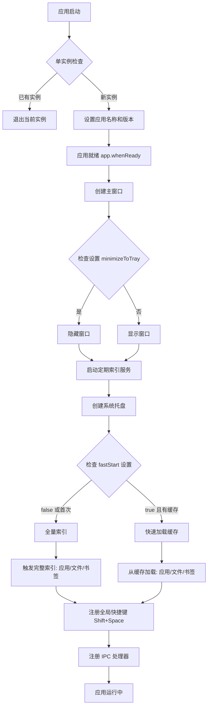
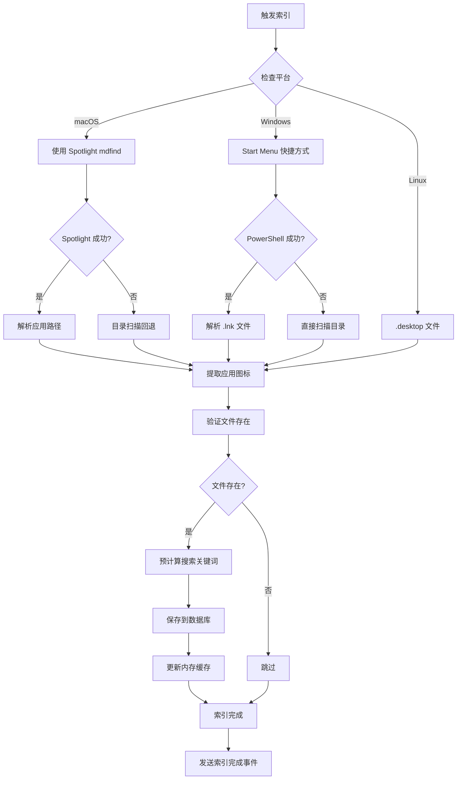
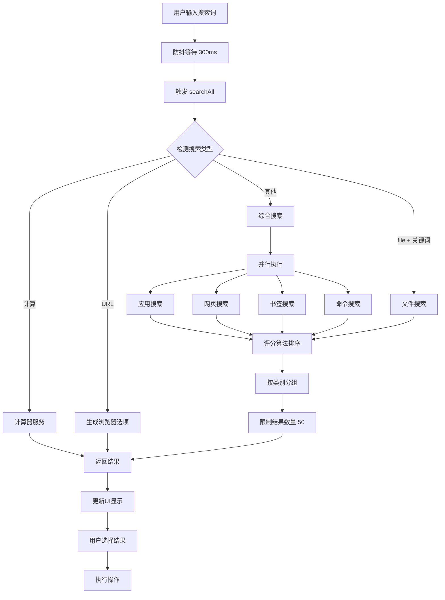
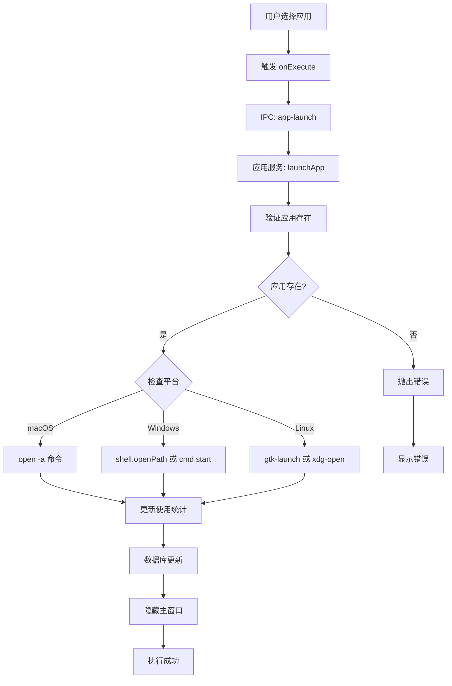
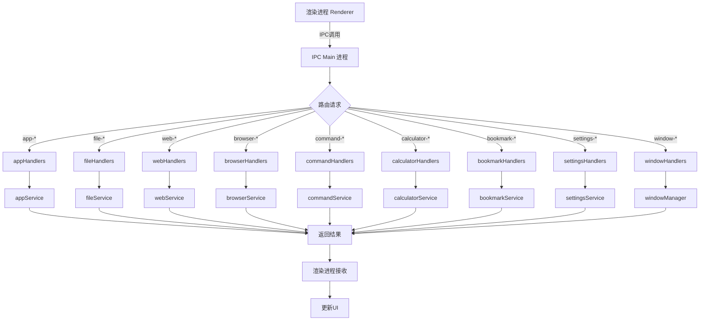
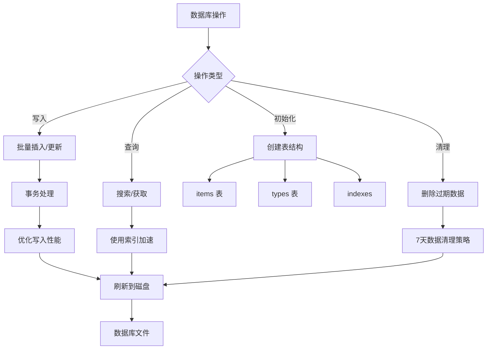
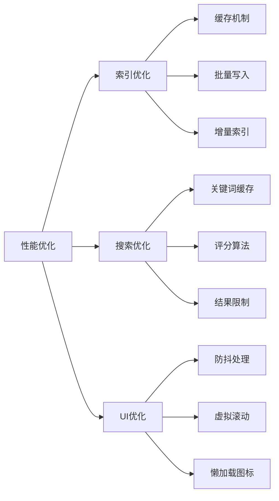

# Lumina 架构流程文档

## 目录
1. [应用启动流程](#应用启动流程)
2. [索引流程](#索引流程)
3. [搜索流程](#搜索流程)
4. [应用执行流程](#应用执行流程)
5. [IPC通信流程](#ipc通信流程)

---

## 应用启动流程



### 启动时序

1. **单实例检查** - 使用 `app.requestSingleInstanceLock()` 确保只运行一个实例
2. **窗口初始化** - 根据 `minimizeToTray` 设置决定是否显示窗口
3. **索引策略**：
   - `fastStart=true` 且有缓存：快速加载（<1秒）
   - `fastStart=false` 或首次：完整索引（可能需要数秒）

---

## 索引流程



### 索引策略

#### macOS
- **主要方案**：Spotlight 索引（毫秒级响应）
- **回退方案**：扫描 `/Applications` 目录

#### Windows
- **主要方案**：解析 Start Menu 快捷方式（.lnk）
- **回退方案**：扫描程序安装目录

#### Linux
- 扫描 `/usr/share/applications` 和用户目录
- 解析 .desktop 文件

---

## 搜索流程



### 搜索匹配算法

```typescript
评分规则:
- 完全匹配名称: 100分
- 名称开头匹配: 80分
- 名称包含匹配: 60分
- 拼音匹配: 40分
- 最近使用加分: +10分（7天内）

排序规则:
1. 评分降序
2. 开头匹配优先
3. 名称长度（短优先）
4. 使用次数
```

---

## 应用执行流程



### 启动命令

| 平台 | 命令 |
|------|------|
| macOS | `open -a "应用路径"` 或 `open <path>` |
| Windows | `shell.openPath()` 或 `cmd /c start "" 应用路径` |
| Linux | `gtk-launch <桌面文件名>` 或 `xdg-open <路径>` |

---

## IPC通信流程



### IPC 处理器

| Handler | 功能 | 对应 Service |
|---------|------|-------------|
| `appHandlers.ts` | 应用获取、搜索、启动、索引 | `appService.ts` |
| `fileHandlers.ts` | 文件搜索、打开、索引 | `fileService.ts` |
| `webHandlers.ts` | 网页搜索、引擎管理 | `webService.ts` |
| `browserHandlers.ts` | 浏览器管理 | `browserService.ts` |
| `commandHandlers.ts` | 命令执行 | `commandService.ts` |
| `calculatorHandlers.ts` | 计算器 | `calculatorService.ts` |
| `bookmarkHandlers.ts` | 书签管理 | `bookmarkService.ts` |
| `settingsHandlers.ts` | 设置管理 | `settingsService.ts` |
| `windowHandlers.ts` | 窗口管理 | `windowManager.ts` |

---

## 数据库管理流程



### 数据表结构

**items 表**（存储所有数据）
- `id`: 唯一标识
- `type`: 类型（app/file/bookmark/...）
- `name`: 名称
- `path`: 路径
- `icon`: 图标 base64
- `searchKeywords`: 搜索关键词
- `indexedAt`: 索引时间
- `launchCount`: 启动次数
- `lastUsed`: 最后使用时间

**types 表**（元数据管理）
- `name`: 类型名称
- `enabled`: 是否启用

---

## 性能优化策略



### 优化技术

1. **缓存机制**：数据库缓存 + 内存缓存
2. **批量操作**：使用事务批量写入
3. **增量更新**：定期索引（10分钟）
4. **搜索优化**：预计算拼音、使用 Map 快速查找
5. **UI响应**：300ms 防抖、限制结果数量 50

---

## 关键配置

### 启动设置
- `autoStart`: 开机自启动
- `minimizeToTray`: 启动时最小化到托盘
- `fastStart`: 快速启动（使用缓存）

### 索引设置
- `indexingInterval`: 索引间隔（默认10分钟）
- `fileSearchEnabled`: 是否启用文件搜索
- `fileSearchPaths`: 自定义搜索路径

### 搜索设置
- `searchDebounce`: 搜索防抖时间（默认300ms）
- `MAX_RESULTS`: 最大结果数量（50）

---

## 架构图

```
┌─────────────────────────────────────────────────────┐
│                   Electron 应用                       │
├─────────────────────────────────────────────────────┤
│  Main Process (Node.js)                             │
│  ┌──────────────┬──────────────┬──────────────┐    │
│  │  Services    │   Handlers   │   Windows    │    │
│  ├──────────────┼──────────────┼──────────────┤    │
│  │appService    │appHandlers   │mainWindow    │    │
│  │fileService   │fileHandlers  │settingsWin   │    │
│  │webService    │webHandlers   │pluginWin     │    │
│  │bookmarkSvc   │browserHandlers│windowManager│    │
│  │browserSvc    │commandHandlers│             │    │
│  │calculatorSvc │calculatorHdl │             │    │
│  │commandSvc    │bookmarkHdl   │             │    │
│  │indexService  │settingsHdl   │             │    │
│  │settingsSvc   │windowHandlers│             │    │
│  └──────────────┴──────────────┴──────────────┘    │
│           ↓ IPC              ↓                      │
├─────────────────────────────────────────────────────┤
│  Renderer Process (React)                           │
│  ┌──────────────┬──────────────┬──────────────┐    │
│  │  MainLayout  │  Components  │   Services   │    │
│  ├──────────────┼──────────────┼──────────────┤    │
│  │SearchBar     │ResultList    │              │    │
│  │SettingsPage  │SearchItem    │              │    │
│  │PluginPage    │              │              │    │
│  └──────────────┴──────────────┴──────────────┘    │
└─────────────────────────────────────────────────────┘
           ↓                    ↓
    ┌─────────────┐      ┌─────────────┐
    │   SQLite DB │      │   系统API    │
    │  (sql.js)   │      │ Spotlight   │
    └─────────────┘      │ PowerShell  │
                         └─────────────┘
```

---

## 总结

**Lumina** 是一个高效、跨平台的快速搜索启动器，主要特点：

1. **多平台支持**：macOS / Windows / Linux
2. **智能索引**：使用系统级索引 API 快速发现应用
3. **全面搜索**：应用、文件、书签、网页、命令、计算器
4. **性能优化**：缓存机制、批量操作、评分算法
5. **用户体验**：全局快捷键、托盘运行、快速响应

---

*最后更新：2024年*

